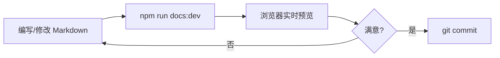
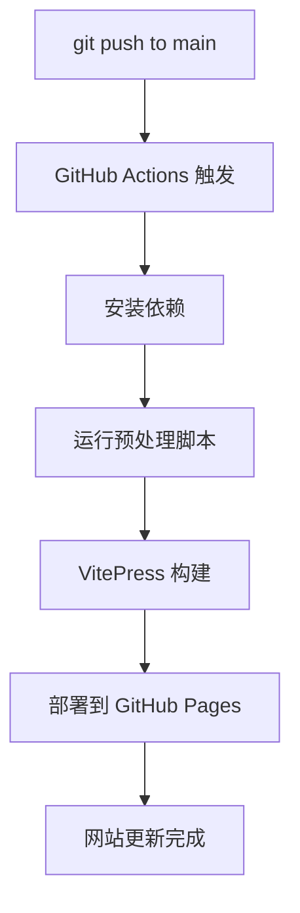

# 技术架构文档

## 整体架构

```
┌─────────────────────────────────────────────────────────┐
│                    GitHub Repository                     │
│                      (AI阅读/)                           │
└─────────────────┬───────────────────────────────────────┘
                  │
                  │ git push
                  ▼
┌─────────────────────────────────────────────────────────┐
│                   GitHub Actions                         │
│  ┌──────────────────────────────────────────────────┐   │
│  │ 1. Checkout code                                 │   │
│  │ 2. Setup Node.js                                 │   │
│  │ 3. Install dependencies (npm ci)                 │   │
│  │ 4. Run prebuild script                           │   │
│  │    - Extract metadata from filenames             │   │
│  │    - Add/update frontmatter                      │   │
│  │    - Extract tags                                │   │
│  │    - Create category indexes                     │   │
│  │ 5. Build with VitePress                          │   │
│  │    - Generate sidebar navigation                 │   │
│  │    - Build search index                          │   │
│  │    - Compile Vue components                      │   │
│  │    - Generate static HTML                        │   │
│  │ 6. Deploy to GitHub Pages                        │   │
│  └──────────────────────────────────────────────────┘   │
└─────────────────┬───────────────────────────────────────┘
                  │
                  │ deploy
                  ▼
┌─────────────────────────────────────────────────────────┐
│                    GitHub Pages                          │
│              https://username.github.io/AI阅读/          │
└─────────────────────────────────────────────────────────┘
```

## 技术栈

### 核心框架

- **VitePress 1.x**: 基于 Vite 和 Vue 3 的静态站点生成器
  - 快速的热重载开发体验
  - 内置全文搜索（minisearch）
  - SEO 友好
  - 响应式设计

### 构建工具

- **Node.js**: JavaScript 运行时
- **npm**: 包管理器
- **TypeScript/JavaScript**: 构建脚本语言

### 部署

- **GitHub Actions**: CI/CD 自动化
- **GitHub Pages**: 静态网站托管

## 目录结构详解

```
AI阅读/
├── .github/
│   └── workflows/
│       └── deploy.yml              # GitHub Actions 工作流配置
│
├── .vitepress/                     # VitePress 配置目录
│   ├── config.mts                  # 主配置文件
│   ├── theme/                      # 自定义主题
│   │   ├── index.ts                # 主题入口
│   │   └── style.css               # 自定义样式
│   ├── scripts/                    # 构建脚本
│   │   ├── generate-sidebar.mjs    # 侧边栏生成器
│   │   └── prebuild.mjs            # 预处理脚本
│   ├── cache/                      # 构建缓存（git ignored）
│   └── dist/                       # 构建产物（git ignored）
│
├── 个人成长/                        # 内容目录
│   ├── index.md                    # 分类索引页
│   └── 作者-书名.md                 # 笔记文件
│
├── 投资/
├── 商业管理/
│   ├── 公司战略/                    # 子分类
│   ├── 市场营销/
│   └── ...
├── 心理学/
├── 健康运动/
├── 社会科学/
├── 思维方式/
│
├── index.md                        # 网站首页
├── package.json                    # 项目配置
├── .gitignore                      # Git 忽略规则
├── README.md                       # 项目说明
├── DEPLOY.md                       # 部署指南
└── ARCHITECTURE.md                 # 本文档
```

## 核心功能实现

### 1. 自动侧边栏生成

**文件**: `.vitepress/scripts/generate-sidebar.mjs`

**功能**:
- 递归扫描内容目录
- 解析文件名提取书名和作者
- 按中文拼音排序
- 生成嵌套的侧边栏结构

**调用时机**: VitePress 配置加载时

### 2. 预处理脚本

**文件**: `.vitepress/scripts/prebuild.mjs`

**功能**:
- 扫描所有 Markdown 文件
- 从文件名提取元数据（作者、书名）
- 从内容中提取标签（`#标签` 格式）
- 添加/更新 frontmatter
- 创建分类索引页

**调用时机**: 构建前（`npm run docs:build`）

### 3. 搜索功能

**实现方式**: VitePress 内置的本地搜索

**特点**:
- 自动索引所有页面内容
- 支持中文分词
- 客户端搜索，无需服务器
- 搜索结果高亮

### 4. 标签系统

**标签格式**:
```markdown
这是一段包含 #价值投资 和 #长期主义 的文本。
```

**处理流程**:
1. 预处理脚本扫描文件内容
2. 正则表达式提取标签
3. 添加到 frontmatter 的 `tags` 字段
4. 可用于未来的标签页面或过滤功能

### 5. 文件命名约定

**格式**: `作者-书名.md`

**示例**:
- `丹尼尔·卡尼曼-思考，快与慢.md`
- `彼得·林奇-彼得·林奇的成功投资.md`

**解析规则**:
- 以第一个 `-` 分割
- 前面部分为作者
- 后面部分为书名

## 工作流程

### 开发流程



### 部署流程



## 性能优化

### 构建优化

1. **增量构建**: VitePress 只重新构建变更的页面
2. **代码分割**: 自动按路由分割 JavaScript
3. **资源压缩**: 自动压缩 HTML、CSS、JavaScript

### 运行时优化

1. **懒加载**: 组件按需加载
2. **预取**: 智能预取可能访问的页面
3. **缓存**: 利用浏览器缓存

### 搜索优化

1. **索引压缩**: 搜索索引经过压缩
2. **客户端搜索**: 无需服务器请求
3. **防抖**: 搜索输入防抖处理

## 扩展性设计

### 添加新功能

#### 1. 添加标签页面

创建 `tags.md`:
```markdown
---
title: 标签云
---

# 所有标签

<script setup>
import { data as tags } from './.vitepress/theme/tags.data.js'
</script>

<div v-for="tag in tags" :key="tag">
  <a :href="`/tags/${tag}`">{{ tag }}</a>
</div>
```

#### 2. 添加阅读统计

在 `.vitepress/theme/index.ts` 中添加：
```typescript
export default {
  enhanceApp({ app, router }) {
    router.onAfterRouteChanged = (to) => {
      // 记录页面访问
      console.log('Visited:', to)
    }
  }
}
```

#### 3. 添加评论系统

集成 Giscus 或其他评论系统：
```typescript
// .vitepress/theme/components/Comments.vue
<template>
  <div class="giscus"></div>
</template>

<script setup>
import { onMounted } from 'vue'

onMounted(() => {
  // 加载 Giscus 脚本
})
</script>
```

### 自定义主题

修改 `.vitepress/theme/style.css` 来定制：
- 颜色方案
- 字体
- 布局
- 动画效果

## 维护指南

### 依赖更新

```bash
# 检查过时的包
npm outdated

# 更新所有依赖到最新版本
npm update

# 更新 VitePress 到最新版本
npm install vitepress@latest
```

### 故障排查

#### 构建失败

1. 检查 Markdown 语法
2. 验证 frontmatter 格式
3. 查看 GitHub Actions 日志

#### 样式异常

1. 清除缓存: `rm -rf .vitepress/cache`
2. 重新构建: `npm run docs:build`

#### 搜索不工作

1. 确保构建成功
2. 检查浏览器控制台错误
3. 验证搜索索引文件存在

## 安全考虑

### 内容安全

- 所有内容经过 Markdown 解析，自动转义 HTML
- 不执行用户提供的 JavaScript
- 使用 Content Security Policy (CSP)

### 依赖安全

```bash
# 审计依赖
npm audit

# 自动修复安全问题
npm audit fix
```

## 未来改进方向

1. **标签页面**: 展示所有标签和相关文章
2. **时间线**: 按时间顺序展示阅读历史
3. **阅读进度**: 跟踪阅读进度
4. **笔记关联**: 文章之间的关联推荐
5. **导出功能**: 导出为 PDF 或其他格式
6. **评论系统**: 集成 Giscus 或 Utterances
7. **统计分析**: 阅读量、热门文章等
8. **RSS 订阅**: 生成 RSS feed
9. **全文导出**: 批量导出所有笔记
10. **AI 摘要**: 使用 AI 生成文章摘要

## 参考资源

- [VitePress 官方文档](https://vitepress.dev/)
- [Vue 3 文档](https://vuejs.org/)
- [GitHub Actions 文档](https://docs.github.com/en/actions)
- [GitHub Pages 文档](https://docs.github.com/en/pages)
