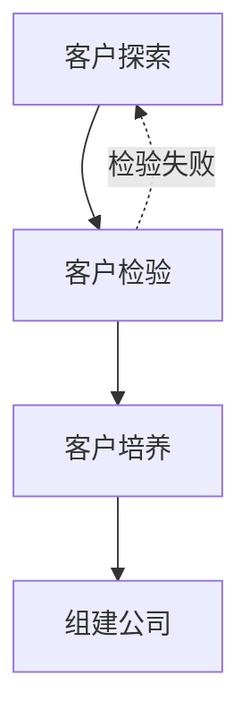

# 四步创业法

## 核心思想

Steven Gary Blank博士在本书中提出了**客户发展方法**（Customer Development），这是一套与**产品开发方法**（Product Development）并行不悖的创业流程。传统的产品开发方法以产品为中心，假设"有产品就有客户"，但事实是市场上九成产品都以失败告终。客户发展方法则要求创业者在开发产品之前，先走出办公室，到用户中间去验证假设、寻找客户、理解需求。

Blank博士的核心观点是：**创业成功的公司都遵循着相同的创业步骤——可以大大减少创业成本的步骤**。客户发展方法与产品开发方法相互配合，前者负责在公司外寻找市场，后者负责在公司内开发产品。

## 第二部分：顿悟之路——客户发展方法

### 客户发展方法概述

客户发展方法把创业初期与客户相关的活动按目标划分成四个阶段：



**核心特征**：每个阶段都是带有递归箭头的圆环，可以重复进行。通过试错来积累经验是客户发展方法的核心思想。

### 四个阶段的目标

| 阶段 | 目标 |
|------|------|
| **客户探索** | 根据既定的产品设计，寻找目标客户，判断产品能否解决客户的问题 |
| **客户检验** | 找出可重复使用的销售模型 |
| **客户培养** | 激发更多潜在客户，把新的购买需求引入销售渠道 |
| **组建公司** | 从学习探索型团队向全速运转的企业过渡 |

### 与产品开发方法的关系

```
┌─────────────────────────────────────────────────────┐
│                    创业公司                           │
├─────────────────────────────────────────────────────┤
│  ┌─────────────────┐    ┌─────────────────┐         │
│  │   产品开发团队    │    │   客户发展团队    │         │
│  │   (公司内部)     │    │   (公司外部)      │         │
│  │   全力开发产品    │    │   尽力发展客户    │         │
│  └────────┬────────┘    └────────┬────────┘         │
│           │                      │                  │
│           └──────────┬───────────┘                  │
│                      ▼                               │
│              两个团队通力合作                         │
└─────────────────────────────────────────────────────┘
```

---

## 第三部分：三种市场类型

市场类型直接决定企业分配营销资源、销售资源、财务资源的方式。

### 三种市场类型对比

| 维度 | 现有市场 | 细分市场 | 全新市场 |
|------|----------|----------|----------|
| **概念** | 生产市场上已有的产品 | 生产改良产品，进一步细分现有市场 | 生产全新产品，开拓全新市场 |
| **客户群** | 已知 | 部分已知 | 未知 |
| **客户需求** | 高性能 | 低价格/小众需求 | 待发掘 |
| **竞争者** | 已知 | 已知 | 未知 |
| **主要风险** | 竞争激烈 | 竞争激烈 + 市场不接纳产品 | 市场不接纳产品 |
| **盈利时间** | 1-2年 | 2-5年 | 5-7年 |

### 新兰切斯特模型

该模型用于判断市场进入时机：

- **>75%市场份额**：市场已被独家垄断，只能选择细分市场
- **前两位>75%且第二位≥28%**：双头垄断，只能选择细分市场
- **26%-47%份额**：市场不稳定，对创业公司有利
- **<26%份额**：市场开放，最适合创业公司生长

**补充规则**：战胜垄断企业的营销成本至少是对方的**3倍**；战胜已领先竞争对手至少是对方的**1.7倍**。

### 市场类型与策略选择

**现有市场**：强调产品的差异化优势

**细分市场**（两种策略）：
- **低成本策略**：显著降低产品成本，向低端用户提供更高性能
- **小众策略**：解决现有产品未满足的特殊需求

**全新市场**：
- 没有竞争对手，但市场情况不明朗
- 关键是说服客户接纳产品
- 做好打持久战的准备（3-7年才能盈利）

---

## 第四部分：客户探索（第一阶段）

### 核心理念

1. **先考虑少数客户的需求，避免广种薄收**
2. **寻找天使客户**：愿意购买早期产品并推广产品的客户
3. **根据创始人的创意开发产品，同时发展客户**

### 天使客户的五个层次

```
未意识到问题存在 → 意识到问题存在 → 主动寻找解决途径 → 自己动手制定解决方案 → 打算/已经申请预算购买
```

天使客户应该在**最后两类**中寻找。

### 客户探索流程

```
┌─────────────────────────────────────────────────────────┐
│ 第零步：争取支持                                         │
│ └─ 获得创始人、董事会支持，理解产品开发与客户发展的区别      │
├─────────────────────────────────────────────────────────┤
│ 第一步：提出假设                                         │
│ └─ A.产品假设  B.客户假设  C.渠道和定价假设               │
│    D.需求创造假设  E.市场类型假设  F.竞争优势假设         │
├─────────────────────────────────────────────────────────┤
│ 第二步：检验有关待解决问题的假设                          │
│ └─ A.约见潜在客户  B.验证客户的问题  C.深入理解客户       │
│    D.收集市场信息                                       │
├─────────────────────────────────────────────────────────┤
│ 第三步：检验有关产品的假设                                │
│ └─ A.第一次评估产品假设  B.准备产品演示  C.再次拜访客户    │
│    D.第二次评估产品假设  E.确定产品顾问委员会成员          │
├─────────────────────────────────────────────────────────┤
│ 第四步：阶段小结                                         │
│ └─ 判断是否完成了客户探索目标，准备进入客户检验            │
└─────────────────────────────────────────────────────────┘
```

### 客户类型划分

| 类型 | 定义 |
|------|------|
| **最终用户** | 产品的实际使用者 |
| **影响决策者** | 影响购买决定但不使用产品的人 |
| **推荐者** | 推荐产品的人 |
| **出资者** | 掌握资金预算并决定实际开支的人 |
| **决策者** | 最终决定购买的人 |
| **作梗者** | 可能阻挠购买决策的人 |

### 投资回报率（ROI）计算

```
客户投资回报率 = 客户获益 ÷ 客户投资成本

获益包括：
- 直接收益（如挽回的损失、节省的成本）
- 间接收益（如效率提升）

投资成本包括：
- 产品购买费用
- 安装部署费用
- 培训费用
- 日常维护费用
```

---

## 第五部分：客户检验（第二阶段）

### 核心理念

**制定销售路线图，而不是组建销售团队**。在完成客户检验之前，仓促组建销售团队是自掘坟墓。

### 什么是销售路线图？

销售路线图回答以下问题：
- 谁影响购买决策？
- 谁是推荐者、出资者、决策者、作梗者？
- 卖出一款产品要说服哪些人？
- 打多少电话？需要多少时间？
- 理想的客户（天使客户）具有哪些典型特征？

### 客户检验流程

```
┌─────────────────────────────────────────────────────────┐
│ 第一步：准备销售产品                                      │
│ ├─ A.提出价值主张                                        │
│ ├─ B.准备销售资料（展示文档、数据表格、报价单等）          │
│ ├─ C.制定渠道策略                                         │
│ ├─ D.制定销售路线图                                       │
│ ├─ E.招聘订单处理员                                      │
│ ├─ F.统一内部意见                                        │
│ └─ G.正式组建产品顾问委员会                               │
├─────────────────────────────────────────────────────────┤
│ 第二步：向潜在客户销售产品                                 │
│ ├─ A.物色天使客户                                        │
│ ├─ B.检验销售路线图                                      │
│ └─ C.检验渠道策略                                        │
├─────────────────────────────────────────────────────────┤
│ 第三步：调整产品定位和公司定位                             │
│ ├─ A.根据市场类型调整产品定位                             │
│ ├─ B.根据市场类型调整公司定位                             │
│ └─ C.向行业分析师和有影响力的人展示产品                   │
├─────────────────────────────────────────────────────────┤
│ 第四步：阶段小结                                          │
│ └─ 判断是否找到天使客户、销售路线图、商业模型               │
└─────────────────────────────────────────────────────────┘
```

### 价值主张的四个要点

1. **情感吸引力**：抓住客户的情感而非理智
2. **突显优势**：让客户感到产品可以解决问题
3. **名副其实**：不能虚假宣传
4. **符合市场类型**：现有市场强调比较优势，全新/细分市场强调突破性优势

### 产品顾问委员会

| 顾问类型 | 作用 | 何时物色 | 人数 |
|----------|------|----------|------|
| 技术顾问 | 提供开发建议、兼任猎头 | 创业伊始到第一批产品面市 | 越多越好 |
| 客户顾问 | 提供产品建议、推荐更多客户 | 客户探索阶段物色 | 越多越好 |
| 行业顾问 | 提高公司信誉和产品知名度 | 客户检验阶段物色 | ≤2人 |
| 商业顾问 | 提供商业策略、管理建议 | 贯穿整个创业过程 | 2-3人 |
| 营销/销售顾问 | 提供营销策略、公关建议 | 客户培养阶段 | 各1人 |

### 客户检验完成条件

- ✅ 找到了愿意购买产品的天使客户
- ✅ 找到了可行的销售渠道和销售模型
- ✅ 找到了确保盈利的商业模型
- ✅ 为业务扩张做好了准备

---

## 第六部分：客户培养（第三阶段）

### 核心理念

客户培养与市场推广的区别：
1. 客户不是现成的，需要引导
2. 关注具体客户，而非宏观市场活动
3. 是创造性的活动
4. 与市场类型密切相关

### 三种发布策略

| 市场类型 | 发布策略 | 特点 |
|----------|----------|------|
| **现有市场** | 全面推广 | 全方位宣传，短时间内高密度信息，短期高成本 |
| **全新市场** | 培养天使客户 | 口碑营销为主，周期长但稳健 |
| **细分市场** | 小众发布 | 精准定位受众，结合产品定位和品牌推广 |

### 客户培养流程

```
┌─────────────────────────────────────────────────────────┐
│ 第一步：准备发布产品                                      │
│ ├─ A.制作市场类型调查问卷                                 │
│ ├─ B.确定市场类型                                        │
│ └─ C.设定首年客户培养目标和销售目标                       │
├─────────────────────────────────────────────────────────┤
│ 第二步：确定产品定位和公司定位                             │
│ ├─ A.物色公关代理公司                                    │
│ ├─ B.广泛征集定位意见                                    │
│ └─ C.根据市场类型调整公司定位和产品定位                   │
├─────────────────────────────────────────────────────────┤
│ 第三步：发布产品                                          │
│ ├─ A.根据市场类型选择发布策略                             │
│ ├─ B.选择目标受众                                        │
│ ├─ C.选择信息发布者（内行、推销员、联系人）              │
│ ├─ D.构思宣传口号                                        │
│ ├─ E.选择发布媒体                                        │
│ └─ F.检验发布效果                                        │
├─────────────────────────────────────────────────────────┤
│ 第四步：阶段小结                                          │
└─────────────────────────────────────────────────────────┘
```

### 三种关键信息发布者

| 类型 | 特点 | 作用 |
|------|------|------|
| **内行** | 行业专家、分析师 | 提供客观意见，受人信赖 |
| **推销员** | 天使客户 | 热情推广，口碑传播 |
| **联系人** | 人脉广泛的人 | 跨领域传播，引爆流行 |

---

## 第七部分：组建公司（第四阶段）

### 核心理念

组建公司是**从学习探索型组织向编制完整的正式企业过渡**的过程。

### 企业文化的三次转变

```
┌─────────────────────────────────────────────────────────┐
│ 第一阶段：客户发展期         →  第二阶段：组建公司期        →  第三阶段：大企业期       │
│ 以客户发展团队为中心           以目标为中心                以流程为中心              │
│ 探索、学习、灵活              目标明确、敏捷              标准化、高效               │
└─────────────────────────────────────────────────────────┘
```

### 跨越鸿沟

```
技术爱好者 ──┐
             │
产品尝鲜者 ──┼──→ 鸿沟 ←── 实用主义者 ──→ 保守主义者 ──→ 怀疑主义者
             │
          早期市场      主流市场
```

鸿沟的宽度由市场类型决定：
- **全新市场**：鸿沟巨大（冰球棍状增长曲线）
- **细分市场**：鸿沟中等（S形增长曲线）
- **现有市场**：鸿沟很小（直线增长曲线）

### 组建公司流程

```
┌─────────────────────────────────────────────────────────┐
│ 第一步：客户过渡                                          │
│ ├─ 根据市场类型准备从天使客户向主流客户过渡               │
│ └─ 根据销售增长经验曲线准备扩大销量                       │
├─────────────────────────────────────────────────────────┤
│ 第二步：树立以目标为中心的企业文化                        │
│ ├─ A.对CEO和管理层进行评估                              │
│ └─ B.树立企业文化（企业目标设定）                       │
├─────────────────────────────────────────────────────────┤
│ 第三步：组建职能部门                                      │
│ ├─ A.设定部门目标                                        │
│ └─ B.设定部门职能                                        │
├─────────────────────────────────────────────────────────┤
│ 第四步：提高各职能部门的反应速度                          │
│ ├─ A.采用以目标为中心的管理模式                          │
│ ├─ B.创造有利于信息收集和传递的文化                      │
│ └─ C.培养员工的主人翁意识                               │
└─────────────────────────────────────────────────────────┘
```

### 以目标为中心的管理模式

**五个要素**：
1. **目标意图**：不仅要做什么，更要理解为什么做
2. **员工主动性**：下放决策权，让员工自主选择实现方式
3. **沟通与相互信任**：好消息要共享，坏消息更要及时反馈
4. **快速决策**：今天能彻底执行的计划远胜过明天的完美计划
5. **协调合作**：部门间横跨式沟通，保持敏捷性

### OODA原则

```
Observe（观察）→ Orient（判断）→ Decide（决策）→ Act（执行）
```

**观察**：各部门能否做好信息收集和传递工作？

**判断**：
- 是否形成了重视市场、客户和竞争者的文化？
- 能否正确理解企业目标和部门目标？

**决策**：各部门管理者能否独立制定决策？

**执行**：
- 是否有高效的流程保证决策立即被执行？
- 是否有办法使各部门的行动协调一致？

---

## 第八部分：关键工具与模板

### 客户探索备忘录结构

```
1-A: 产品假设
1-B: 客户假设
1-C: 渠道和定价假设
1-D: 需求创造假设
1-E: 市场类型假设
1-F: 竞争优势假设
2-A: 约见潜在客户
2-B: 验证客户的问题
2-C: 深入理解客户
2-D: 收集市场信息
3-A: 第一次评估产品假设
3-B: 准备产品演示
3-C: 再次拜访客户
3-D: 第二次评估产品假设
4-A: 阶段小结
```

### 企业目标模板

| 要点 | 内容 |
|------|------|
| **我们的工作目标** | [战略愿景] |
| **怎样实现目标** | [具体行动] |
| **做到什么程度才算成功** | [可量化指标] |
| **收入和利润目标** | [财务指标] |

### 部门目标模板（以营销部门为例）

| 要点 | 内容 |
|------|------|
| **工作目标** | 创造终端客户需求并将需求引入销售渠道 |
| **怎样实现目标** | 准备宣传资料、利用广告公关展销会等 |
| **做到什么程度才算成功** | 第一年争取40,000位有效客户、品牌识别度达65% |
| **收入和利润目标** | 第一年占35%市场份额、开支不超75万美元 |

---

## 第九部分：核心概念速查

| 概念 | 定义 |
|------|------|
| **客户发展方法** | 一套研究和发现客户的方法，与产品开发方法并行 |
| **天使客户** | 意识到问题存在、主动寻找解决途径、甚至自己动手制定解决方案的客户 |
| **销售路线图** | 经过早期客户验证的销售流程，回答谁影响决策、如何说服等问题 |
| **价值主张** | 用一两句话表达公司核心价值观，连接公司与客户的价值纽带 |
| **产品定位** | 产品在客户心目中的位置，取决于市场类型 |
| **公司定位** | 公司存在的理由和独特之处 |
| **需求创造** | 帮助潜在客户认识产品并引发购买行为的活动 |
| **完整产品** | 客户购买后马上可以投入使用的产品 |
| **以目标为中心** | 设定明确目标而非固定流程，保持敏捷性的管理方式 |
| **OODA原则** | 观察-判断-决策-执行，军事理论用于商业决策 |

---

## 延伸阅读

| 书名 | 作者 | 理由 |
|------|------|------|
| **《精益创业》** | Eric Ries | 延续并普及了Blank的客户发展理念，提出了"构建-测量-学习"的反馈循环，是精益创业运动的奠基之作 |
| **《跨越鸿沟》** | Geoffrey Moore | 深入分析了技术接纳生命周期，特别是早期市场与主流市场之间的鸿沟问题，与本书互补性强 |
| **《创新者的窘境》** | Clayton Christensen | 提出了破坏性创新理论，解释了为什么优秀企业会失败，与市场类型理论相呼应 |
| **《启示录：打造用户喜爱的产品》** | Marty Cagan | 强调产品管理的重要性，提供了打造成功产品的具体方法 |
| **《有的放矢》** | Nathan Furr | 基于Blank理论的实践指南，专注于创业者的战略选择 |
| **《Running Lean》** | Ash Maurya | 将精益创业方法论具化为可操作的流程图和检查清单 |
| **《引爆点》** | Malcolm Gladwell | 解释了如何像流行病一样传播ideas，对客户培养阶段的传播策略有启发 |

---

> *"这不是结局，战争还远没有结束，现在只能算是刚刚开始。"* —— 温斯顿·丘吉尔