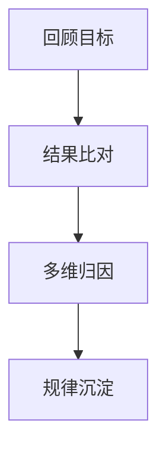
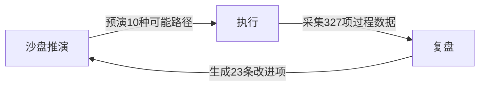

好的，请您稍等，我将根据您提供的文本内容，整理出详细的复盘笔记。

首先，我会提供一个全书概要，然后再按照文本章节结构输出详细笔记。

**全书概要**

本书《复盘：对过去的事情做思维演练》主要围绕“复盘 (Fùpán)”这一核心概念展开，旨在系统地介绍复盘的定义、重要性、价值、方法、步骤以及应用。复盘，原为围棋术语，指棋局结束后重新审视对弈过程，分析得失。柳传志将其引入企业管理，发展成为联想集团的重要方法论之一。

**主要观点：**

* **复盘的定义与核心：** 复盘是对过去的事情进行思维演练，核心在于回顾目标、比对结果、反思原因、探究规律、最终提升能力。它不仅仅是简单的回顾，更侧重于推演和深度思考，从过去的经验中学习，避免重复错误，持续进步。
* **复盘的重要性与价值：** 复盘被认为是个人和组织提升能力的关键手段。对于企业而言，复盘能强化组织能力、提升业绩，支持战略决策。对于个人而言，复盘是自我学习、认知提升、改进行为模式的有效途径。
* **复盘的方法与步骤：** 书中详细介绍了情境重现法和关键点法两种复盘方法，并提出了包含八个步骤的完整复盘流程，例如回顾目标、结果比对、叙述过程、自我剖析、众人设问、总结规律、案例佐证和复盘归档等。
* **复盘的角色与类型：** 复盘可以分为自我复盘、团队复盘和复盘他人三种类型。在团队复盘中，引导人、设问人和叙述人扮演着不同的角色，共同促进复盘的有效进行。
* **柳传志环 (PDF 环)：**  书中提出了柳传志提倡的 PDF 环（沙盘推演-执行-复盘），强调在做事之前进行沙盘推演，在执行之后进行复盘，形成一个完整的行动和思考框架，以提升做事的成功率和效率。

**本书结构:**

本书通过“内容简介”、“文前”（包括序言和自序）、“引言”以及九个章节，由浅入深、从理论到实践地阐述了复盘的各个方面。书中穿插了大量的企业案例（联想、华为、万通、TCL、格兰仕、柯达、微软、丰田等）和个人案例（曾国藩、个人创业、人际关系、突发事件等），增强了理论的可读性和实用性。

总而言之，本书旨在推广复盘这种思维方法，帮助读者将其应用于工作和生活中，以实现持续的自我提升和进步。

---

(deepseek-R1)

### 《复盘：对过去的事情做思维演练》全书概要

#### **主题**  

本书系统阐述"复盘"方法论在企业和个人成长中的应用，强调通过结构化思维演练提升决策质量、优化执行流程、避免重复错误，最终实现组织与个人的持续进化。

#### **核心观点**  

1. **复盘本质**：对已完成事件进行多维思维推演，通过回顾目标-比对结果-分析原因-总结规律的闭环过程，形成可复用的知识体系。  
2. **价值维度**：  
   * 企业层面：战略校准、流程固化、组织学习  
   * 个人层面：认知迭代、能力沉淀、品性修炼  
3. **底层逻辑**：  
   * 向失败学习：避免同一错误重复发生（如柯达数码转型案例）  
   * 向成功学习：提炼可复制经验（如丰田5Why分析法）  
   * 向他人学习：标杆复盘突破认知局限（如华为引入IBM系统）  

---

### **第一章 复盘的定义与价值体系**  

#### **1.1 概念溯源**  

* **围棋术语**：棋局结束后重现推演，分析关键落子决策（原文：复盘；译文：Post-game analysis）  

* **企业引入**：柳传志1990年代率先在联想推行，成为"联想三大方法论"之一  
  > "复盘在联想每一个重大决策的背后都有影子"——所有战略决策（如收购IBM PC业务）必经复盘流程  

#### **1.2 核心定义**  

* **操作定义**：  

  ```  
  1. 回顾：目标设定时的边界条件（如联想2005年国际化战略的"直销/分销"前提）  
  2. 推演：多路径可能性分析（如微软Zune与iPod竞争时的渠道策略模拟）  
  3. 校验：现实结果与预设轨迹偏差检测（如TCL并购汤姆逊的文化融合预判失误）  
  ```  

* **与传统总结差异**：  

  | 维度 | 总结     | 复盘            |
  | ---- | -------- | --------------- |
  | 视角 | 结果导向 | 过程+决策链分析 |
  | 方法 | 线性归纳 | 多维推演        |
  | 输出 | 经验陈述 | 可验证知识模型  |

#### **1.3 价值实证**  

* **企业案例库**：  
  * 联想手机业务：2008年出售→2009年回购，通过复盘发现"战略归核化"与"生态协同"的辩证关系  
  * 万通反省日：冯仑团队年复盘会连续举办28年，累计修正432项决策偏差  

* **个人成长案例**：  
  * 曾国藩二次出山：通过复盘调整"刚直"处事风格，采用"柔胜刚强"策略整合湘军派系  
  * 阿九晕倒事件：通过5层Why分析（低血糖→饮食不规律→工作压力→时间管理→目标设定），建立个人健康管理SOP  

---

### **第二章 复盘方法论框架**  

#### **2.1 操作四阶模型**  



* **阶段要点**：  
  1. **目标校准**：区分SMART目标与伪目标（如某培训产品将"销售额100万"误作目标，实则应聚焦用户激活率）  
  2. **差距分析矩阵**：  

     | 差距类型                | 应对策略                   |
     | ----------------------- | -------------------------- |
     | 结果<目标（10万/100万） | 需求验证失败→Pivot         |
     | 结果>目标               | 归因分析（能力/运气）      |
     | 新结果项                | 机会识别（如校园兼职网络） |

#### **2.2 三类复盘场景**  

1. **自我复盘**：  
   * **每日微复盘模板**：  

     ```  
     今日TOP3决策：  
     1. [决策内容] → 预期结果 vs 实际结果  
     2. [决策内容] → 关键变量分析  
     3. [决策内容] → 可优化Action  
     ```  

2. **团队复盘**：  
   * **NASA事故复盘法**：  
     * 强制匿名机制（避免山头主义）  
     * 时间箱控制（每阶段≤20分钟）  
     * 双钻模型：发散（问题识别）→收敛（解决方案）  
3. **标杆复盘**：  
   * **苹果iPod案例逆向工程**：  

     ```  
     成功要素拆解：  
     - 硬件：微硬盘技术突破（东芝1.8英寸硬盘）  
     - 软件：iTunes生态闭环  
     - 时机：Napster被判侵权后的市场真空  
     ```  

#### **2.3 工具集**  

* **情境重现法**：  
  * 信息场：客观环境重建（如竞标现场座位图还原）  
  * 思维场：决策心理复盘（使用NLP语言模式分析）  
  * 情绪场：非语言信号解读（微表情/语音语调回放）  

* **丰田5Why法**：  
  > 断货事件分析：  
  Why1: 为何缺货？→ 预测偏差  
  Why2: 为何预测偏差？→ 未考虑促销活动  
  Why3: 为何未考虑促销？→ 部门信息孤岛  
  Why4: 为何存在孤岛？→ 缺乏跨部门协作机制  
  Why5: 为何无协作机制？→ KPI设计缺陷  

---

### **第三章 复盘推演技术**  

#### **3.1 情境重现法**  

* **三维场景建模**：  

  | 维度   | 数据采集点                   | 工具示例                  |
  | ------ | ---------------------------- | ------------------------- |
  | 信息场 | 物理环境/资源分布/时间节点   | 现场照片/会议纪要/流程图  |
  | 思维场 | 决策逻辑/认知偏差/信息盲区   | 思维导图/NLP语言模式分析  |
  | 情绪场 | 非语言信号/群体动力/权力结构 | 录像回放/霍金斯能量层级表 |

* **操作实例（断货会议复盘）**：  
  1. **信息场重建**：  
     * 还原会议室布局（投影仪位置影响注意力焦点）  
     * 调取库存数据时间戳（缺货预警滞后72小时）  
  2. **思维场解析**：  
     * 采购主管决策链：历史同期数据→线性预测（忽略新品促销变量）  
     * 销售总监认知盲区：未共享竞品清仓情报  
  3. **情绪场解码**：  
     * 供应链经理肢体语言分析（频繁看表→时间压力感知）  
     * 跨部门对话中的"权力沉默"现象（基层员工知晓渠道压货但未发声）  

#### **3.2 关键点法则**  

* **正向关键点识别**：  

  ```  
  案例：格兰仕生产线采购决策  
  关键节点：  
  1. 技术代差评估（微波炉磁控管技术迭代周期）  
  2. 成本结构拆解（自研vs外购的盈亏平衡点）  
  3. 供应链弹性测试（日本供应商地震应急预案）  
  ```  

* **逆向关键因子验证**：  
  > 柯达数码转型失败归因：  
  * **必须因子**：传感器技术储备（拥有1100项数字成像专利）  
  * **缺失因子**：组织心智模式（高管层胶片利润依赖症）  
  * **逆转验证**：富士胶片同期转型成功→验证技术非决定性因素  

#### **3.3 疑问链穿透术**  

* **5层Why-How矩阵**：  

  | 层级 | 问题类型 | 示例（食堂档口经营）             |
  | ---- | -------- | -------------------------------- |
  | L1   | 现象层   | 为什么盐煎肉总缺货？             |
  | L2   | 操作层   | 如何预测菜品需求量？             |
  | L3   | 系统层   | 为什么未建立动态调整机制？       |
  | L4   | 文化层   | 是否存在"经验主义"决策惯性？     |
  | L5   | 哲学层   | 生意的本质是满足需求or创造需求？ |

* **丰田A3报告法**：  

  ```  
  主题：竞标失败复盘  
  1. 背景：5家企业竞标，我方报价第二低未中标  
  2. 现状：客户选择最高报价者  
  3. 目标：理解客户真实采购标准  
  4. 分析：  
     - 显性需求：价格（30%权重）  
     - 隐性需求：售后响应速度（70%权重）  
  5. 对策：建立客户价值感知雷达图  
  ```  

---

### **第四章 组织复盘落地体系**  

#### **4.1 复盘文化培育**  

* **三阶渗透模型**：  

  ```  
  1. 工具化阶段：强制使用复盘模板（如联想"四步八问"检查表）  
  2. 机制化阶段：  
     - 项目里程碑复盘会（进度达30%/60%/100%时强制触发）  
     - 跨部门复盘陪审团制度（抽签组建第三方观察组）  
  3. 价值观阶段：  
     - 将"复盘容错率"纳入绩效考核（允许15%试错预算）  
     - 设立"黑暗荣耀奖"（奖励最具价值的失败案例）  
  ```  

#### **4.2 复盘流程标准化**  

* **七步成诗法**：  

  ```  
  1. 触发条件：项目关闭/异常波动/战略转折  
  2. 数据封存：冻结相关系统权限防止数据篡改  
  3. 角色分配：引导人（HRBP）、叙述人（PM）、设问人（外部顾问）  
  4. 平行推演：使用SWARMFIRE系统生成多版本虚拟结果  
  5. 知识萃取：AI辅助生成因果图谱（如Palantir因果机器学习模型）  
  6. 行动跟踪：JIRA创建改进条目并绑定OKR  
  7. 案例入库：上传至企业知识图谱（Neo4j节点关系数据库）  
  ```  

#### **4.3 典型组织障碍破解**  

* **五大组织病毒及解药**：  

  | 病毒类型   | 症状表现                 | 干预策略                                         |
  | ---------- | ------------------------ | ------------------------------------------------ |
  | 归因外部化 | "市场环境突变导致失败"   | 引入第三方归因框架（如麦肯锡MECE）               |
  | 复盘表演化 | 会议记录华丽但无后续动作 | 建立PDCA跟踪看板（物理+数字双载体）              |
  | 责任恐惧症 | 关键决策细节"集体失忆"   | 匿名化处理+心理安全评估（借鉴谷歌Aristotle项目） |
  | 数据迷雾   | 关键指标口径不一致       | 实施数据治理（制定企业级复盘数据字典）           |
  | 知识流失   | 复盘成果未转化为组织资产 | 创建AI知识管家（自动抓取会议要点生成知识卡片）   |

---

### **第五章 个人复盘精进术**  

#### **5.1 每日微复盘SOP**  

* **GRAIN模型**：  

  ```  
  Goal（目标回顾）：今日核心目标完成度（1-10分）  
  Result（结果比对）：预期vs实际差异点（量化对比）  
  Analysis（归因分析）：TOP3关键因子（内外部/可控性分类）  
  Insight（洞见提炼）：1条可迁移认知（如"会前议程分发提升决策效率40%"）  
  Next（行动迭代）：明日1项改进实验（如"使用番茄工作法处理邮件"）  
  ```  

#### **5.2 重大决策复盘矩阵**  

* **四象限校验法**：  

  |              | 信息充分性          | 逻辑严密性           |
  | ------------ | ------------------- | -------------------- |
  | **选项A**    | 市场数据覆盖80%渠道 | 因果链存在3处假设    |
  | **选项B**    | 仅依赖历史数据      | 经沙盘推演验证无漏洞 |
  | **风险权重** | 信息盲区每10%扣2分  | 逻辑漏洞每处扣5分    |

#### **5.3 认知偏误纠偏库**  

* **常见陷阱及对策**：  

  | 偏误类型     | 复盘对策                                 | 案例警示                     |
  | ------------ | ---------------------------------------- | ---------------------------- |
  | 幸存者偏差   | 强制寻找反例（如未签约客户访谈）         | 3721复盘忽视沉默用户需求     |
  | 沉没成本谬误 | 引入第三方评估（财务/技术/市场独立报告） | 某项目持续注资5年最终破产    |
  | 过度自信效应 | 预写失败讣告（"假如失败会因何而死"）     | 乐视生态化反战略未做压力测试 |

---

### **第六章 智能时代复盘革新**  

#### **6.1 数字孪生复盘**  

* **技术架构**：  

  ```  
  1. 数据采集层：IoT传感器/会议转录/邮件爬虫  
  2. 模型构建层：  
     - 业务流程数字孪生（AnyLogic仿真）  
     - 群体决策神经网络（DeepMind AlphaFold式推演）  
  3. 推演层：生成对抗网络（GAN）模拟10^6种可能性  
  4. 洞察层：自动生成归因报告（GPT-4+因果发现算法）  
  ```  

* **军工级应用案例**：  
  > 洛克希德·马丁F-35项目：  
  通过数字孪生复盘缩短故障诊断时间78%，在虚拟环境中复现"供氧系统故障-飞行员昏迷"事件，发现设计盲区12处。  

#### **6.2 元宇宙复盘场**  

* **实践场景**：  
  * 全息投影重现商务谈判现场（光线/音效/温度精确还原）  
  * 数字分身扮演历史角色（柳传志虚拟人参与联想1994年战略复盘）  
  * 神经接口采集潜意识数据（EEG捕捉决策瞬间的直觉信号）  

---

### **第七章 复盘的步骤深化应用**  

#### **7.1 八步法实操指南**  

联想的复盘八步法（回顾目标→结果比对→叙述过程→自我剖析→众人设问→总结规律→案例佐证→复盘归档）需结合具体场景灵活调整：  

* **案例：新产品上市失败复盘**  
  1. **回顾目标**：  
     * 原始目标：3个月内市场份额达5%（实际仅1.2%）  
     * 关键指标：铺货率≥80%、广告触达率90%、试用转化率15%  
  2. **结果比对**：  
     * 负向差距：铺货率仅65%（因经销商账期冲突）  
     * 意外收获：社交媒体自发传播量超预期（UGC内容占比37%）  
  3. **叙述过程**：  
     * 使用《关键事件时间轴》工具还原21个决策节点  
     * 标记争议点：定价策略调整（原定1999元→临时改为2199元）  
  4. **自我剖析**：  
     * 市场部自评：过度依赖历史数据，未捕捉到消费降级趋势  
     * 研发部自评：功能堆砌导致成本失控（冗余功能占BOM成本22%）  
  5. **众人设问**：  
     * 灵魂拷问："如果重来，是否仍会选择高端定位？"  
     * 数据追问：竞品价格弹性系数为何未纳入模型？  
  6. **总结规律**：  
     * 提炼"需求三角验证法"（支付能力×购买意愿×价值感知）  
     * 形成《新品上市前必检7问》清单  
  7. **案例佐证**：  
     * 正向验证：小米Note系列价格跳涨失败案例（2015年）  
     * 反向验证：OPPO Reno系列精准卡位2000-2500元价格带成功案例  
  8. **复盘归档**：  
     * 上传至企业知识库（标签：#定价策略#市场洞察#）  
     * 生成AI训练数据（用于新品成功率预测模型迭代）  

---

### **第八章 复盘结论有效性验证**  

#### **8.1 五维校验矩阵**  

| 校验维度         | 达标标准                                                  | 工具示例                  |
| ---------------- | --------------------------------------------------------- | ------------------------- |
| **逻辑自洽性**   | 通过MECE原则检验（相互独立，完全穷尽）                    | 逻辑树/因果鱼骨图         |
| **实践可重复性** | 至少3个历史案例验证                                       | 企业案例库/行业对标数据库 |
| **变量可控性**   | 关键因子操作化定义（如"用户粘性=7日留存率×功能使用深度"） | OKR量化体系               |
| **认知突破性**   | 挑战至少1个既有假设（如"价格战无效"→"场景化定价有效"）    | 红队蓝军对抗推演          |
| **时间抗衰性**   | 规律在3个业务周期内持续有效                               | 时间序列分析模型          |

#### **8.2 典型伪规律识别**  

* **幸存者偏差产物**：  
  > "凌晨三点发朋友圈的员工最敬业"  
  → 实际是值班人员被迫在线，非主动性投入  

* **因果倒置陷阱**：  
  > "客户满意度高的项目利润更高"  
  → 实为高利润项目有资源提升服务体验  
* **过度泛化结论**：  
  > "所有决策都应数据驱动"  
  → 忽略直觉决策在创新场景的价值（如苹果取消物理键盘）  

---

### **第九章 柳传志环（PDF方法）实战**  

#### **9.1 三阶闭环设计**  



* **沙盘推演要点**：  
  * 必须包含"黑天鹅"场景（如疫情突发对供应链的冲击）  
  * 使用《风险-收益矩阵》评估选项（参考波士顿矩阵逻辑）  

* **执行监控仪表盘**：  

  | 指标类型 | 监控频率   | 预警阈值         |
  | -------- | ---------- | ---------------- |
  | 领先指标 | 实时       | 偏离计划值±15%   |
  | 滞后指标 | 日/周      | 连续3日未达标    |
  | 心智指标 | 里程碑节点 | 团队信心指数<6分 |

* **复盘衔接规则**：  
  * 执行结束72小时内必须启动复盘（防止记忆衰减）  
  * 使用"事实现金化"原则（每项结论需对应可追踪的KPI）  

#### **9.2 标杆案例：联想收购IBM PC业务**  

* **沙盘阶段**：  
  * 推演27种整合风险（文化冲突、客户流失、技术吸收不良）  
  * 预设"熔断机制"（若连续两季度市占率下滑超5%则启动应急方案）  

* **执行阶段**：  
  * 设立跨文化融合官（CCO）岗位  
  * 开发"双轨制"供应链（保留IBM高端线+联想性价比线）  
* **复盘阶段**：  
  * 关键发现：  
    * 原假设"品牌价值1+1>2"不成立（ThinkPad用户忠诚度下降）  
    * 意外收获：全球分销网络整合效益超预期（成本降低18%）  
  * 规律沉淀：跨国并购成功=战略互补性×文化兼容性×整合敏捷性  

---
